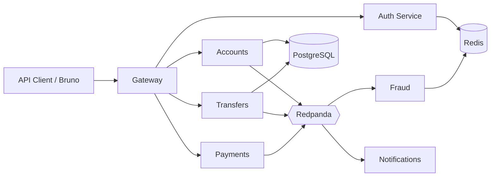

# Fintech Core Platform — Repositorio público

Implementación progresiva del backend fintech — **reconstruido desde cero**, fase a fase, con ritmo de estudio profundo.

**Origen:** inspirado por [esta publicación de LinkedIn](https://www.linkedin.com/feed/update/urn:li:activity:7469881203920351232/) y [arkano-banking-challenge](https://github.com/AndresED/arkano-banking-challenge).

**Artículos (serie canónica):** https://www.makingcode.dev/series/fintech-core-platform  
**LinkedIn:** resumen por fase → enlace al artículo del blog.

## Arquitectura objetivo (estado final)



## Estructura del monorepo

```
fintech-core-platform/
├── apps/
│   ├── gateway/              # Fase 7
│   ├── auth-service/         # Fase 4
│   ├── accounts-service/     # Fase 0–1
│   ├── transfers-service/    # Fase 2
│   ├── payments-service/     # Fase 3
│   ├── fraud-service/        # Fase 5
│   └── notifications-service/# Fase 6
├── libs/
│   ├── domain-common/        # Money, IDs, Result types
│   ├── messaging/            # Kafka client, outbox helpers
│   └── observability/        # OTel Fase 6
├── docs/
│   ├── architecture/
│   │   └── evolution.md      # Diagrama v0 → vN
│   └── phases/
│       ├── phase-0/README.md
│       ├── phase-1/README.md
│       └── ...
├── infra/
│   ├── docker/
│   │   └── docker-compose.yml
│   └── terraform/            # Fase 12
├── .github/workflows/ci.yml
├── package.json
└── pnpm-workspace.yaml
```

## Cómo leer este repo

1. Empieza por [`docs/phases/phase-0/README.md`](./docs/phases/phase-0/README.md) (cuando exista código).
2. Cada fase es mergeable de forma independiente; tags `phase-0`, `phase-1`, …
3. Teoría profunda: repo privado (no enlazado públicamente).

## Stack

NestJS 11 · TypeScript · PostgreSQL · Redis · **Redpanda** (Kafka) · **[MiniStack](https://ministack.org/)** (AWS dev) · Jest · Testcontainers

Stack local: [`docs/local-dev/README.md`](./docs/local-dev/README.md)

## Autor

Andrés Esquivel — [andresed.dev](https://www.andresed.dev/)

## Licencia

MIT (sugerido para portafolio)
